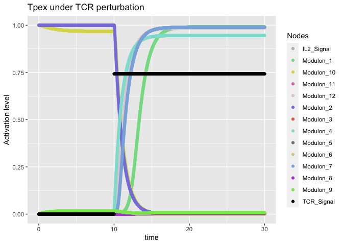
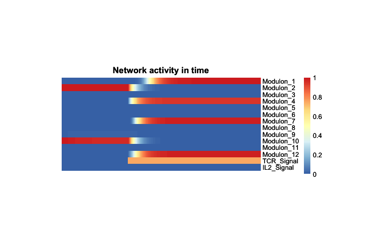

<!-- README.md is generated from README.Rmd. Please edit that file -->

# SimNetR

SimNetR aims to simulate the dynamics of network-based continuous models
defined by ordinary differential equations (ODEs). It allows for
simulating node perturbations, including both positive and negative
effects, with various intensities and modalities such as constant,
temporal, and peaks.

The formalism adopted by SimNetR originates from the method proposed in
“A method for the generation of standardized qualitative dynamical
systems of regulatory networks” published in Theoretical Biology and
Medical Modelling (March, 2006). In the SimNetR framework, the state of
a node is defined by the following equation:


The right-hand side of the differential equation consists of two
components: an activation function and a decay term. Activation is
modeled by a sigmoid function of ω, representing the total input to the
node. The sigmoid function chosen ensures that it passes through the
points (0,0) and (1,1) regardless of the value of its gain, h. By
bounding the node’s activation level to the closed interval \[0,1\], it
can be interpreted as a normalized value, facilitating direct comparison
between discrete (Boolean) and continuous dynamical systems.
Subsequently, the second part of the equation represents a decay term,
which is simply proportional to the node’s activation level for
simplicity.

## Installation

You can install the development version of SimNetR from
[GitHub](https://github.com/) with:

``` r
# install.packages("devtools")
devtools::install_github("icrespocasajus/SimNetR")
```

## Example

This is a basic example which shows you how to run a simulation.

### Load the package

``` r
library(SimNetR)
```

### Load other required packages

``` r
library(operators)
library(ggplot2)
library(reshape2)
library(deSolve)
library(pheatmap)
```

### Load the network

``` r
net = network
head(net[,c('Source','Interaction','Target','Weight'),drop=F])
#>                            Source Interaction     Target    Weight
#> Modulon_4 -| Modulon_2  Modulon_4          -|  Modulon_2 20.000000
#> Modulon_5 -| Modulon_1  Modulon_5          -|  Modulon_1 12.671858
#> Modulon_3 -| Modulon_9  Modulon_3          -|  Modulon_9 11.949296
#> Modulon_3 -| Modulon_6  Modulon_3          -|  Modulon_6 11.512036
#> Modulon_6 -| Modulon_10 Modulon_6          -| Modulon_10 10.361713
#> Modulon_5 -| Modulon_8  Modulon_5          -|  Modulon_8  9.759594
```

### Load some known phenotypes

``` r
initial.states = phenotypes
initial.states[,c("Centroid_NaiveLike","Centroid_Tpex","Centroid_Tex")]
#>            Centroid_NaiveLike Centroid_Tpex Centroid_Tex
#> IL2_Signal                  0             0            0
#> Modulon_1                   0             0            1
#> Modulon_10                  0             1            0
#> Modulon_11                  0             0            0
#> Modulon_12                  0             0            1
#> Modulon_2                   1             1            0
#> Modulon_3                   0             0            0
#> Modulon_4                   0             0            1
#> Modulon_5                   0             0            0
#> Modulon_6                   0             0            0
#> Modulon_7                   0             0            1
#> Modulon_8                   1             0            0
#> Modulon_9                   1             0            0
#> TCR_Signal                  0             0            1
```

### Set up the simulation parameters

``` r
mode = 'weights'
time.step.size = 0.01
time.limit = 30
h = 10
times = seq(0, time.limit, by=time.step.size)
```

### Define initial state

``` r
initial_state = 'Centroid_Tpex'
initial.states[initial_state]
#>            Centroid_Tpex
#> IL2_Signal             0
#> Modulon_1              0
#> Modulon_10             1
#> Modulon_11             0
#> Modulon_12             0
#> Modulon_2              1
#> Modulon_3              0
#> Modulon_4              0
#> Modulon_5              0
#> Modulon_6              0
#> Modulon_7              0
#> Modulon_8              0
#> Modulon_9              0
#> TCR_Signal             0
```

### Define perturbation

``` r
perturbation = perturbNodes(nodes = c("TCR_Signal"), 
                                at.times = c(10),
                                duration = c(20),
                                intensity = c(0.75),
                                time.step.size = time.step.size,
                                times)
```

### Run the simulation

``` r
initial_state = 'Centroid_Tpex'
nodes = sort(unique(c(net[,1],net[,3])))

network.dynamics = list()
for(initial.state.name in c(initial_state)){
  initial.state = as.numeric(initial.states[nodes, initial.state.name])
  names(initial.state) = nodes
  network.dynamics[[initial.state.name]] = network.dynamics.ODE(net=net,
                                                                state=initial.state,
                                                                mode=mode,
                                                                weights=net$Weight,
                                                                h=h,
                                                                gamma=1,
                                                                time.limit = time.limit,
                                                                perturbations=perturbation)
}
```

## Plot the simulation

``` r
# Assign colors to the nodes
node.color = c(
  Modulon_1="#83DC92FF",
  Modulon_2= "#8881E0FF", 
  Modulon_3= "#E0745EFF",
  Modulon_4= "#8EE0D5FF",
  Modulon_5= "#87807DFF",
  Modulon_6= "#DACF93FF",
  Modulon_7= "#88B1DEFF",
  Modulon_8="#BB4EDFFF",
  Modulon_9="#85E957FF",
  Modulon_10="#DAD957FF",
  Modulon_11="#DB7EBAFF",
  Modulon_12="#E0D0D5FF",
  TCR_Signal ="black", 
  IL2_Signal ="grey")

plot.tmp = plotPerturbation(dat=network.dynamics[[initial_state]],col=node.color,title = "Tpex under TCR perturbation")
plot.tmp 
```



### Plot the simulation as a trajectory heatmap

``` r
library(pheatmap)
# Plotting trajectory
trajectory.heatmap.input = as.data.frame(network.dynamics[[initial_state]])
rownames(trajectory.heatmap.input) = paste0(trajectory.heatmap.input$time)
trajectory.heatmap.input = as.data.frame(t(trajectory.heatmap.input[,-c(1)]))
trajectory.heatmap = pheatmap::pheatmap(main = 'Network activity in time',
                              trajectory.heatmap.input[names(node.color),],
                              cluster_rows = F,
                              cluster_cols = F,
                              cellheight = 10,
                              cellwidth = 0.1,
                              show_rownames = T,
                              show_colnames = F)
trajectory.heatmap
```



### Plot the simulation as a trajectory heatmap: initial and final states

``` r
final = as.data.frame(t(as.data.frame(network.dynamics[[initial_state]])))
final = final[c(2:nrow(final)), ncol(final), drop=F]
initial.vs.final = data.frame(Initial=initial.states[nodes,initial_state], Final=final[nodes,1])
rownames(initial.vs.final) = nodes

initial.vs.final.heatmap = pheatmap::pheatmap(main = "Initial Vs. Final state",
                                              as.matrix(initial.vs.final)[names(node.color),],
                                              cluster_rows = F,
                                              cluster_cols = F,
                                              cellheight = 10,
                                              display_numbers = T,
                                              cellwidth = 20,
                                              show_rownames = T,
                                              show_colnames = F)

initial.vs.final.heatmap
```


## Authors

Ana Rodriguez


Ana Rodriguez Sanchez-Archidona, phD  
Chargé de recherche  
CHUV \| Department of Oncology \| George Coukos group  
Ludwig Institute for Cancer Research \| Lausanne Branch  
Rue du Bugnon 25A, CH-1005 Lausanne, 4th floor, Room 190  
Switzerland  
<arsanchezarchidona@gmail.com>

Isaac Crespo


Isaac Crespo, phD  
Senior Computational Scientist  
CHUV \| Department of Oncology \| George Coukos group  
Ludwig Institute for Cancer Research \| Lausanne Branch  
AGORA, Bugnon 25A, 1005 Lausanne, 4th floor, Room 026  
<isaaccrespo@hotmail.com>
