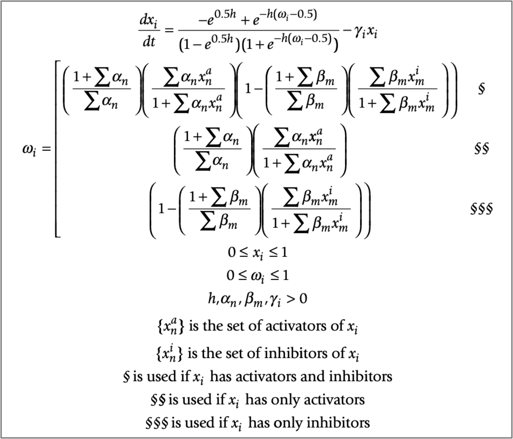

---
output:
  rmarkdown::html_vignette: default
  github_document: default
---

<!-- README.md is generated from README.Rmd. Please edit that file -->

```{r, include = FALSE}
knitr::opts_chunk$set(
  collapse = TRUE,
  comment = "#>",
  fig.path = "man/figures/README-",
  out.width = "100%"
)
```


# SimNetR

SimNetR aims to simulate the dynamics of network-based continuous models defined by ordinary differential equations (ODEs). It allows for simulating node perturbations, including both positive and negative effects, with various intensities and modalities such as constant, temporal, and peaks.

The formalism adopted by SimNetR originates from the method proposed in "A method for the generation of standardized qualitative dynamical systems of regulatory networks" published in Theoretical Biology and Medical Modelling (March, 2006). In the SimNetR framework, the state of a node is defined by the following equation:


```{r out.width="75%",out.height="100%", fig.align = "center",dpi=1200, echo=F}

```

The right-hand side of the differential equation consists of two components: an activation function and a decay term. Activation is modeled by a sigmoid function of ω, representing the total input to the node. The sigmoid function chosen ensures that it passes through the points (0,0) and (1,1) regardless of the value of its gain, h. By bounding the node's activation level to the closed interval [0,1], it can be interpreted as a normalized value, facilitating direct comparison between discrete (Boolean) and continuous dynamical systems. Subsequently, the second part of the equation represents a decay term, which is simply proportional to the node's activation level for simplicity.


## Installation

You can install the development version of SimNetR from [GitHub](https://github.com/) with:

``` r
# install.packages("devtools")
devtools::install_github("icrespocasajus/SimNetR")
```

## Example

This is a basic example which shows you how ...

```{r example,results=FALSE,message=FALSE}

```


## Authors

Ana Rodriguez

```{r , out.width="10%",echo=F}

```

Ana Rodriguez Sanchez-Archidona, phD  
Chargé de recherche  
CHUV | Department of Oncology | George Coukos group  
Ludwig Institute for Cancer Research |  Lausanne Branch  
Rue du Bugnon 25A, CH-1005 Lausanne, 4th floor, Room 190  
Switzerland  
arsanchezarchidona@gmail.com  


Isaac Crespo

```{r , out.width="10%",echo=F}
knitr::include_graphics("../man/figures/README-isaaccrespo.jpg")
```

Isaac Crespo, phD  
Senior Computational Scientist  
CHUV | Department of Oncology | George Coukos group  
Ludwig Institute for Cancer Research |  Lausanne Branch  
AGORA, Bugnon 25A, 1005 Lausanne, 4th floor, Room 026  
isaaccrespo@hotmail.com
